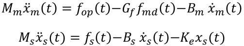
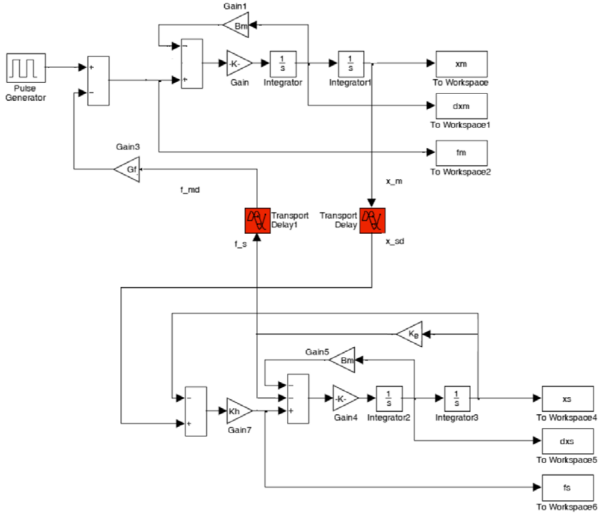

# Bilateral control of a tele-operated robot

The master/slave telemanipulation system has the following dynamics:

The values are as follows:

* Mm,s =1, Bm,s = 20 mass and friction, respectively, of master and slave.
* Ke= 100, environment impedance.
* Gf= 1, force reflection gain.

The force reflection scheme developed and implemented is as follows:

Calculations were made for the transmission of energy variables (speed and force) and transmission of wave variables. In addition, a delay of T= 0 s.; 0.1 s and 1s was taken into account.
